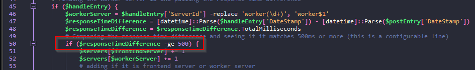

# WebResponseCheck

Example of a PowerShell script that can read and output from a log file.

Straight forward PowerShell script that can be used to read a log file with an example log style.

To run (using PowerShell):
```
path/to/directory/WebResponseCheckv3.ps1
```

Log Transaction sample:
```
2022-06-10T09:46:37.330 6300c7d4-dec5-43cf-af65-f9700745d33b GET /doc/comments - - - frontend19
2022-06-10T09:46:37.490 6300c7d4-dec5-43cf-af65-f9700745d33b HANDLE - - - - worker36
2022-06-10T09:46:37.600 6300c7d4-dec5-43cf-af65-f9700745d33b RESPOND - - 200 - frontend19
```

Log file is in a simple format with the following fields:
```
datestamp, request GUID, action type, requested url, -, status, -, server/worker id
```

The .ps1 will prompt for the path of the log file and then will prompt for a location to save the log file:


This will take some time depending on the size of the log file so be patient :)

Once the script has ran, the console will display an output to show any server that has a response time of over 500ms and will order them by their average highest response time:


The response time can be configured by editing the .ps1 file on line 50 for POST to HANDLE actions and line 80 for HANDLE to RESPOND actions:




The log output file that is generated contains the same statistics as the console but also includes all of the entries that matches the criteria from the log. For example:


This script should run on any Windows system. I have attached 2x sample logs - a full size log with 600,000 log entries and a significantly shortened version with only 1000 lines (much quicker for testing). I have also attached a sample output file to show what you can expect - sample_output.log
